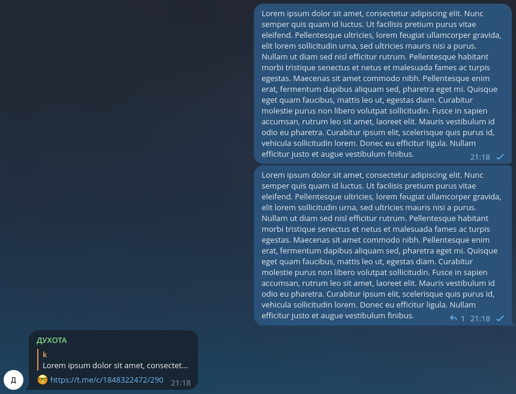

# Telegram Dukhota Bot

<link rel="preconnect" href="https://fonts.googleapis.com">
<link rel="preconnect" href="https://fonts.gstatic.com" crossorigin>
<link href="https://fonts.googleapis.com/css2?family=Montserrat+Alternates:wght@700&display=swap" rel="stylesheet">

    
  <b>Terraform Pull Request Automation</b>

## Info

Bot to filter duplicate messages from group chat.

It notifies on:

- Full duplicates (e.g. copy-pasted, forwarded twice)
- 90%+ similar text
- 66%+ similar media and 80%+ similar text

### Example

1. Send message #1 with an image and caption text
1. Send message #2 with same image and slightly changed text
1. Bot replies to message #2 with link to message #1

### Usage

Just add `@dukhota_bot` to your group chat.

## Roadmap

- Web UI with per-channel settings
- Split logic to receiver/worker/settings
- Helm chart

## Naming

Духота (rus.) [dukhota] - stuffiness, absence of fresh air.

In russian, we sometimes call nerdy persons "dushnila", which is related to stuffiness.

Sadly, `@dushnila_bot` were already taken by someone's dead project, so this one became `@dukhota_bot`.
